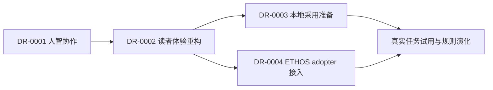

# 决策依赖图

- **DR-0001 → DR-0002**：入口与场景卡必须保留人设定方向、验真与归责的结构。
- **DR-0002 → DR-0003**：试用准备复用入口与行动卡，不复制规范性正文。
- **DR-0002 → DR-0004**：文档质量门成为文档型 adopter 的原生证明之一。
- **DR-0003 / DR-0004 → 真实试用**：真实运行证据决定后续保留、修订或废止，不由宣传替代。
