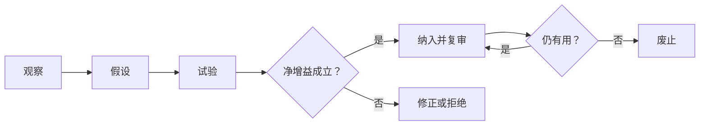

# 实践与演化

**何时使用**：同类问题重复、需要带教或评审、准备新增模板/工具/规则，或现有机制成为负担时。沉淀的目标是下次更早发现、更容易判断、更少人工兜底，不是增加文件数。

## 从真实失败模式开始

新增机制前，回答：观察到什么失败；现有边界和反馈为何不足；新办法减少什么风险、增加多少认知与维护成本；如何小范围试验；什么观察支持保留；谁维护、何时复审、何种信号触发修订或退出。未经试验的偏好不直接升为部门规则。失去对象、无人使用、与事实源重复或净成本为负的规则应废止。

可复用资产可以是测试、监控、清单、决策记录、示例、规则、平台能力或更好的责任接口。选择最轻、可检索、有人消费和维护的一种；已有权威源应引用，不复制。对重复故障或高影响失误，至少区分止损、直接修正和防复发机制。

## 以真实工作培养能力

任务开始时对齐对象、边界和成功标准；关键判断点看事实、假设、选项与风险；交付后只选最重要的认知或表达偏差，约定下一次可观察的改进。保留少量成功与失败样例并解释原因，逐步从指导下执行走向独立判断、形成方法和带教他人。反馈指向具体命题、证据、行为与后果，不使用“逻辑不行”之类无法行动的标签。

评审先看证据，再判断交付风险。至少审视问题定义、逻辑模型、证据和不确定性、方案取舍、执行验收、口头与书面表达及 Agent 委托验真。伪造或隐藏事实、无当前验证而称完成、越权实施高风险变更、隐瞒阻断等硬风险，不会被表达流畅或工作量大抵消。评分若有使用，应说明级别、可观察行为和用途，不能当作人的整体价值。

## 观察系统，不制造数字崇拜

留意目标或口径含混造成的返工、下游才发现的质量问题、重复故障、风险暴露时机、重新打开的完成声明、决策等待原因、交接可继续性、Agent 误用，以及新机制是否降低总成本。每个指标先说明支持什么决定、事实源、周期、边界和可被博弈的方式；异常要回到样例和机制，不直接等同个人绩效。

团队可在现有会议、工单与评审中抽取真实样本定期校准，不为遵守固定节奏另建全员报表。管理者应澄清方向、优先级、资源和跨域裁决，保护如实暴露不确定性的人；不能把系统缺陷归咎于个人。成员负责其责任域的端到端结果。准则维护者收集冲突与失效信号，说明每次增删的理由、证据与生效范围。

紧急时先保护人、数据、生产和合规，允许先止损后补齐，但要记录临时决定的事实与授权、失效时间、接管人和回退条件；风险受控后补验证和复盘。同类紧急例外反复出现，就按机制问题处理。具体规则变更仍需走[仓库治理流程](governance/ethos.md)，团队实际采用须由真实工作样本验证，不能由文档发布推定。
