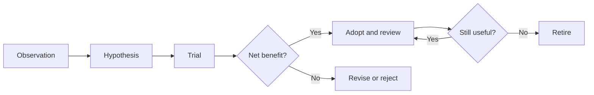

# Practice and Evolution

**When to use:** A problem repeats, coaching or review is needed, a template,
tool, or rule is proposed, or an existing mechanism has become a burden. The aim
of learning is to find the next failure earlier, judge it more easily, and need
less manual rescue—not to increase the file count.

## Start with a Real Failure Mode

Before adding a mechanism, answer: What failure was observed? Why were the
existing boundary and feedback insufficient? What risk would the new method
reduce, and what cognitive and maintenance cost would it add? How can it be
tried on a small scale? What observation would justify keeping it? Who maintains
it, when is it reviewed, and what signal triggers revision or retirement? An
untested preference is not a department rule. Retire a rule that has lost its
subject, has no user, duplicates a source of truth, or costs more than it
returns.

Watch small changes without treating one anomaly as a trend: drifting
definitions, recurring questions, temporary human rescue, expired evidence,
ambiguous ownership, intermittent failures, and slight delays can be early
signals of a system defect. Check their pattern, impact, and direction before
building a remedy. A problem that recurs, crosses people or projects, depends
on one person's tacit knowledge, could cause material loss if forgotten, or
will be repeated by Agents needs a reusable prevention mechanism. Choose its
lightest effective owner rather than another report.

A reusable asset may be a test, monitor, checklist, decision record, example,
rule, platform capability, or clearer ownership interface. Choose the lightest
option that can be found, used, and maintained. Link to an existing authority
rather than copying it. For repeated or high-impact failures, distinguish
containment, direct correction, and prevention of recurrence.

## Grow Capability Through Real Work

At the start of a task, align on subject, boundary, and success criteria. At
important decisions, examine facts, hypotheses, options, and risks. After
delivery, choose the most consequential gap in reasoning or expression and agree
on an observable improvement for the next task. Keep a few successful and failed
examples with reasons. Move gradually from guided execution to independent
judgment, method-building, and coaching. Feedback names a proposition, evidence,
behavior, and consequence; a label such as “weak logic” gives no actionable
direction.

Review evidence before judging delivery risk. At minimum, inspect problem
framing, the logical model, evidence and uncertainty, trade-offs, execution and
acceptance, oral and written communication, and delegation and verification of
Agents. Fabricating or hiding facts, claiming completion without current
verification, exceeding authority on a high-risk change, and concealing a
blocker are hard risks. Fluent presentation or effort does not cancel them. If
scoring is used, define the levels, observable behavior, and purpose; do not
treat a score as a person's overall worth.

Every task must meet the hard boundaries. Critical responsibilities should be
performed independently and reliably. Call a result exceptional only when it
also transfers a method, reduces recurring cost, or improves others' capacity.
If a five-level review is used, keep its meaning stable:

| Level             | Observable delivery risk                                                                          |
| ----------------- | ------------------------------------------------------------------------------------------------- |
| 1: unacceptable   | The subject, facts, or responsibility are confused enough to invite a wrong action.               |
| 2: below standard | Useful fragments exist, but reasoning, evidence, or delivery has a material gap.                  |
| 3: borderline     | The work is usable with guidance, not yet reliable independently.                                 |
| 4: meets standard | The person can independently make bounded judgments, executable choices, and reliable acceptance. |
| 5: strong         | The result also leaves a transferable method or system improvement.                               |

## Observe the System Without Worshipping Numbers

Watch for rework from unclear goals or definitions, quality failures found
downstream, repeated incidents, late exposure of risk, reopened completion
claims, reasons decisions wait, handoff continuity, Agent misuse, and whether a
new mechanism lowers total cost. For every metric, first name the decision it
supports, its fact source, period, boundary, and how it could be gamed.
Investigate anomalies through cases and mechanisms; do not equate them directly
with individual performance.

For every L1 or L2 task, align the subject and success condition at the start,
verify at the end, and preserve a handoff when interrupted. Review real work
samples at natural decision and delivery points. Look for recurring failures,
escaped quality issues, Agent misuse, and needless coordination, then retain,
revise, or retire rules by observed net benefit. Do this in existing meetings,
tickets, and reviews, without a fixed calendar or department-wide status
report. Managers clarify direction, priorities, resources, and cross-domain
decisions, and protect honest disclosure of uncertainty; system defects must
not be blamed on individuals.

Members own end-to-end results in their remit. Guideline maintainers gather
conflicts and signs of obsolescence, and state the reason, evidence, and
effective scope for each addition or deletion.

In an emergency, protect people, data, production, and compliance first. Contain
harm before filling in the record if needed, but record the temporary decision's
facts and authorization, expiry, takeover owner, and rollback condition.
Complete verification and review once risk is controlled. Repeated “emergency
exceptions” are a system problem. Specific rule changes still follow
[repository governance](governance/ethos.md). Team adoption must be shown
through real work, not inferred from publication.
