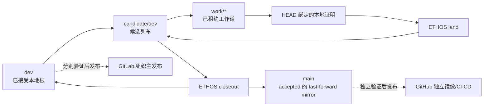

# 本仓库的 ETHOS 治理

> **状态 Status:** canonical（仓库治理的当前政策）
>
> **目的 Purpose:** 将变更、证据、完成主张与发布边界纳入 ETHOS，而不复制团队工作准则。
>
> **参见 See also:** [文档导航](../README.md)、
> [ETHOS adopter 决策](../decisions/accepted/DR-0004-ethos-adoption.md)、
> [持久证据说明](../evidence/README.md)。

本文件不复制或改写 [`guidelines.md`](../../guidelines.md) 的工作质量规则。

## 事实边界

- [`guidelines.md`](../../guidelines.md) 是团队工作准则的唯一事实源；README 与
  AGENTS 只承担路由，ETHOS 只治理仓库操作。
- 本仓库是**文档型 adopter**。其原生正确性由 Markdown 格式、lint、链接/锚点和
  Mermaid 渲染共同证明，命令定义在 `.ethos/profile.toml`。
- 两个 provider 文档投影只经 `bash tools/ci/scripts/with-python-runtime.sh --`
  调用同一仓库内 verifier；GitHub 先在 hosted runner 完成 checkout，再显式选择 Node 22
  与 Chrome，GitLab 在 Docker runtime 中先安装 Git、Python 与 Chromium。该 wrapper 只创建
  当前 checkout 的 `build/runtime/venv` 临时运行时，不是证据、Change 生命周期或远端执行主张。
- 两个 hosted 投影都显式选择同一份受跟踪的
  `tools/ci/config/mermaid-puppeteer-hosted.json`。它只在受控 CI 中通过共享 verifier 传给
  Mermaid；shared verifier 会把同一已校验的选择转交给其嵌套的 rollout-readiness 校验。
  本地 `scripts/validate-docs.sh` 默认不加载该配置，因而不把 hosted Chrome 的 sandbox 兼容
  例外扩展为本地默认。
- 本地验证与安装不依赖远端。GitLab 是组织主发布源；GitHub 是独立完整仓库与 CI/CD
  镜像平面，可在 GitLab 不可用时作为更新与分发替代。两者均只接收 `dev`、`main`
  与 `submit/*`，绝不接收 `work/*` 或 `candidate/dev`。两套等价 CI 定义和两个
  remote 的配置只说明发布面可被调用；每个远端的 ref、CI、渲染和发布仍须分别取得
  新鲜证据，不能由本地完成主张或 remote 配置代替。
- `.ethos/state/` 是本机租约、证明和协调状态，始终忽略；跟踪的 `.ethos/*.toml`、
  OpenSpec、文档、脚本与 evidence 才是仓库事实。

## 本地闭环

1. 在 `dev` 观察和启动候选列车；不得直接以 `main` 承担本地接受根。
2. 只在已租约的 `work/*` 中修改受跟踪文件，并先执行
   `./scripts/ethos-repo.sh lane prewrite`。
3. 用当前 HEAD 的
   `./scripts/ethos-repo.sh prove --execute --scope docs --expect-head <HEAD> --json`
   记录本地证明；`./scripts/ethos-repo.sh land` 只推进候选列车。
4. 只有受控 closeout 才能把 `candidate/dev` 快进到 `dev`，并将 `main` 作为
   `dev` 的本地 fast-forward mirror 同步到同一 SHA。不得直接移动 `main`。
5. `candidate/dev` 只在本地候选列车中存在，不得推送至 GitLab 或 GitHub；仓库的
   `pre-push` hook 会在调用通用 ETHOS 准入前拒绝该分支作为 source 或 target。远端发布只从
   `dev`、`main` 或 `submit/*` 发起，并对 GitLab 与 GitHub 分别观察、执行和验收；CI 文件或
   remote 配置都不得被写成已经镜像、已运行或已发布。

## Change、DR 与证据的边界

实质性治理、规范、proof、决策拓扑、claim 或 authority 变更，先建立一个 active OpenSpec
Change，并按 proposal → design/specs → tasks/claim → verification → archive 推进。官方
OpenSpec 校验与仓库绑定的 `./scripts/ethos-repo.sh openspec --lifecycle --json` 共同构成
生命周期依据；当前 ETHOS runner 的 plan、prove 与 admission 接线以 ETHOS 正式实现为准。
Change 归档前不得把实现称为本地完成；归档后仍须以 HEAD 绑定 proof 支撑 land。

DR 只记录持久选择；Chronicle 只记录带日期的实际观察；`guidelines.md` 只记录团队规则。
执行方法、临时计划和 Agent 方法包可作为私有辅助，但不是本仓库的规范、决策、proof 或
治理载体。`bash ./scripts/validate-governance-boundary.sh` 只补充检查 DR 形态、日期型
决策文件和已退役执行方法文档；它不重复实现 OpenSpec lifecycle、claim binding、archive
preflight 或 material-path admission，也不是 `.ethos/profile.toml` 的 proof gate。
ETHOS 的 material-path bootstrap contract 已进入 authoritative `dev` runner。本仓库已按其
实际 contract 声明 `[openspec].material_paths`，并为本 Change 添加只含 `schema_version` 与
`paths` 的 Change-local `scope.toml` companion。该 companion 属于 ETHOS-owned read model，
毗邻但不扩展官方 OpenSpec workflow schema；`lane prewrite`、`plan --changed` 与 `prove` 共同
使用它。任何未覆盖 material path 都必须以 `openspec_material_path_uncovered:<path>` 拒绝，且
正反例验证后才允许本 Change 归档。

## 文本空行规则

- Markdown：语义块之间一个空行，禁止连续空行；Prettier 是最终格式事实。
- TOML、YAML、JSON：顶层逻辑块之间一个空行；表、映射和数组内部不插空行。
- Python：顶层函数或类之间两个空行；类成员与普通逻辑阶段之间一个空行。
- Shell：guard、变量初始化和逻辑阶段之间一个空行；顶层函数之间两个空行。

`bash ./scripts/validate-text-layout.sh` 只检查这些可机械判断的边界，不以增删空行规避
其他质量门或文本预算。

## 仓库根绑定

本机的全局 `ethos` 启动器从 ETHOS 实现仓库加载程序；实现所在位置不是本仓库的治理对象。
因此本仓库所有人机可执行命令都必须经过
[`scripts/ethos-repo.sh`](../../scripts/ethos-repo.sh)：它固定 `--root` 为自身所在的 Git
仓库根，并拒绝调用者传入另一个 `--root`。Git hooks 也使用同一适配器。

`./scripts/test-ethos-repo.sh` 是仓库根绑定 contract 的显式验证：它验证适配器报告的审计根
等于当前仓库根，且调用方无法覆盖该根。`repository-root-binding` 保留为
`.ethos/profile.toml` 的可选 repository-native gate descriptor，供修改适配器或其调用边界时
以 `ethos prove --gate repository-root-binding` 显式执行；它不在
`[proof].code_correctness_gates`，故不属于 profile 选择的默认 code-correctness floor；该
profile 只选择 `docs-integrity` 与 `markdown-format`。默认 adopter proof 还会执行 ETHOS
共享治理门，不能被误写成仅有两个总 gate。三个 repository-native descriptor 都以 `bash`
调用脚本，不依赖执行位。无论是否执行该可选验证，所有实际 ETHOS 调用和 pre-commit 准入
仍必须经过根绑定适配器；OpenSpec lifecycle 则仍由 ETHOS command plane 负责，不能由此
descriptor 取代。

## 可移植 hooks

`.githooks/` 只调用仓库绑定的适配器，不依赖某台机器上的 ETHOS 源码路径。执行
`./scripts/ethos-repo.sh hook install --json` 后，Git 通过
`core.hooksPath=.githooks` 启用提交、推送和引用移动的准入。工作者必须令
`ETHOS_ACTOR` 与 Work Lane 租约的 `holder_ref` 一致。

## 语义文档与持久证据

本仓库采用 ETHOS 的最小语义文档内核：

- [`docs/`](../README.md) 负责导航；[`docs/decisions/`](../decisions/README.md)、
  [`docs/evidence/`](../evidence/README.md)、[`docs/reference/`](../reference/README.md)
  与 [`docs/history/`](../history/README.md) 分别承担取舍、可审阅依据、稳定边界与历史语境；
- [`evidence/`](../../evidence/) 是持久主张、Chronicle 与投影材料的根；`build/evidence/`、
  `build/ethos/` 与 `.ethos/state/` 是可再生或本机状态，不以文件存在即构成仓库事实；
- [`evolution/ledger.toml`](../../evolution/ledger.toml) 记录待证伪的演化假设，使“持续改进”
  保持为可验证的学习，而非无边界扩张。

这些结构只承载仓库治理与证据，不复制 `guidelines.md` 的团队工作规则。

## 不作的主张

本文件不主张 GitLab 或 GitHub 已同步、任一 hosted CI 已实际运行、任一远端已验证链接锚点，
或团队已经在真实工作中采用本准则。即使 remote 已配置，这些结论仍需要各自新鲜、可复查的
外部或运行证据。

本文件同样不主张 ETHOS 产品与其历史嵌入式后端已完成能力迁移或 shadow parity。当前 adopter
以外部 ETHOS runner 和本仓库 profile 工作；`quality command-examples` 对产品命令手册的检查，
以及依赖嵌入式后端的 `parity shadow`，均不构成本仓库的 proof gate。它们若失败，必须如实作为
ETHOS 产品迁移事项处理，不得由本仓库删除本地脚本、伪造命令或降低文档质量来换取通过。
