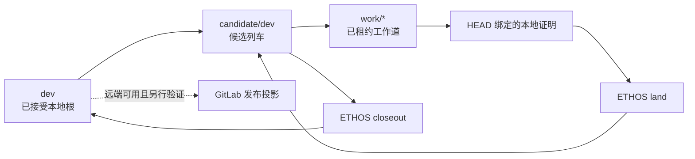

# 本仓库的 ETHOS 治理

> **状态 Status:** canonical（仓库治理的当前政策）
>
> **目的 Purpose:** 将变更、证据、完成主张与发布边界纳入 ETHOS，而不复制团队工作准则。
>
> **参见 See also:** [文档导航](../README.md)、
> [ETHOS adopter 决策](../decisions/2026-07-12-ethos-adoption.md)、
> [持久证据说明](../evidence/README.md)。

本文件不复制或改写 [`guidelines.md`](../../guidelines.md) 的工作质量规则。

## 事实边界

- [`guidelines.md`](../../guidelines.md) 是团队工作准则的唯一事实源；README 与
  AGENTS 只承担路由，ETHOS 只治理仓库操作。
- 本仓库是**文档型 adopter**。其原生正确性由 Markdown 格式、lint、链接/锚点和
  Mermaid 渲染共同证明，命令定义在 `.ethos/profile.toml`。
- 远端为 GitLab SSH 地址，但仓库目前没有 `.gitlab-ci.yml`；因此采用与当前形态相符的
  `generic` profile。GitLab CI、远端发布和 GitLab 实际渲染都是待外部验证的投影，
  不是本地完成主张。
- `.ethos/state/` 是本机租约、证明和协调状态，始终忽略；跟踪的 `.ethos/*.toml`、
  OpenSpec、文档、脚本与 evidence 才是仓库事实。

## 本地闭环

1. 在 `dev` 观察和启动候选列车；不得直接以 `main` 承担本地接受根。
2. 只在已租约的 `work/*` 中修改受跟踪文件，并先执行
   `./scripts/ethos-repo.sh lane prewrite`。
3. 用当前 HEAD 的
   `./scripts/ethos-repo.sh prove --execute --scope docs --expect-head <HEAD> --json`
   记录本地证明；`./scripts/ethos-repo.sh land` 只推进候选列车。
4. 只有受控 closeout 才能把 `candidate/dev` 快进到 `dev`。远端发布必须在连接恢复后
   单独观察和执行。

## 仓库根绑定

本机的全局 `ethos` 启动器从 ETHOS 实现仓库加载程序；实现所在位置不是本仓库的治理对象。
因此本仓库所有人机可执行命令都必须经过
[`scripts/ethos-repo.sh`](../../scripts/ethos-repo.sh)：它固定 `--root` 为自身所在的 Git
仓库根，并拒绝调用者传入另一个 `--root`。Git hooks 也使用同一适配器。

`./scripts/test-ethos-repo.sh` 是常驻证明门：它验证适配器报告的审计根等于当前仓库根，且
调用方无法覆盖该根。没有这项证明，不得把“ETHOS 已治理本仓库”当作完成结论。

## 可移植 hooks

`.githooks/` 只调用仓库绑定的适配器，不依赖某台机器上的 ETHOS 源码路径。执行
`./scripts/ethos-repo.sh hook install --json` 后，Git 通过
`core.hooksPath=.githooks` 启用提交、推送和引用移动的准入。工作者必须令
`ETHOS_ACTOR` 与 Work Lane 租约的 `holder_ref` 一致。

## 语义文档与持久证据

本仓库采用 ETHOS 的最小语义文档内核：

- [`docs/`](../README.md) 负责导航；[`docs/decisions/`](../decisions/README.md)、
  [`docs/evidence/`](../evidence/README.md)、[`docs/reference/`](../reference/README.md)
  与 [`docs/history/`](../history/README.md) 分别承担取舍、可审阅依据、稳定边界与历史语境；
- [`evidence/`](../../evidence/) 是持久主张、Chronicle 与投影材料的根；`build/evidence/`、
  `build/ethos/` 与 `.ethos/state/` 是可再生或本机状态，不以文件存在即构成仓库事实；
- [`evolution/ledger.toml`](../../evolution/ledger.toml) 记录待证伪的演化假设，使“持续改进”
  保持为可验证的学习，而非无边界扩张。

这些结构只承载仓库治理与证据，不复制 `guidelines.md` 的团队工作规则。

## 不作的主张

本文件不主张 GitLab CI 已配置、远端引用已同步、GitLab 已验证链接锚点，或团队已经在
真实工作中采用本准则。这些结论需要各自新鲜、可复查的外部或运行证据。

本文件同样不主张 ETHOS 产品与其历史嵌入式后端已完成能力迁移或 shadow parity。当前 adopter
以外部 ETHOS runner 和本仓库 profile 工作；`quality command-examples` 对产品命令手册的检查，
以及依赖嵌入式后端的 `parity shadow`，均不构成本仓库的 proof gate。它们若失败，必须如实作为
ETHOS 产品迁移事项处理，不得由本仓库删除本地脚本、伪造命令或降低文档质量来换取通过。
