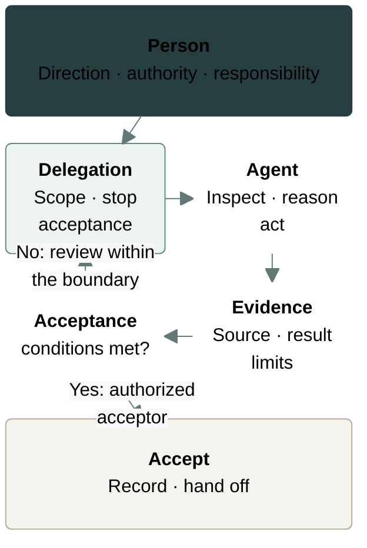

<!--
---
subject: data-department-work-guidelines:human-agent
role: policy
state: canonical
relations:
  canonical_for: human agent delegation verification and responsibility
---
-->

# Human–AI Collaboration

**When to use:** When a member delegates search, analysis, drafting, changes,
tests, or review to an Agent. Agents extend people's capacity to investigate,
reason, and act within a delegated boundary. People retain direction,
authorization, decisions, and responsibility for consequences. An Agent is an
executing or reasoning entity, not a source of organizational authorization.
Stop when the target, fact source, responsible person, or permission cannot be
established; a person checks the actual work and evidence before accepting an
Agent's result.

## Delegate a Boundary, Not a Pile of Context

A consequential delegation states the goal and decision it supports, current
authorities and fact sources, subject and scope, non-goals, the deliverable's
format, destination, audience, and level of detail. It also names time,
security, compatibility, and cost constraints; permissions and forbidden
actions; acceptance, checkpoints, stop conditions, and interruption handoff. A
low-risk task can be stated briefly. A high-risk one names the owner, recovery
path, and who approves irreversible actions.

If missing context does not materially affect direction, safety, or authority,
the Agent should continue with reasonable stated assumptions. If the target,
fact source, responsible person, authority, or irreversible consequence cannot
be established, stop and ask. “Finish this for me” is not an authorization
boundary.

> **Illustrative delegation:** “Compare the vendor's earlier and revised price
> snapshots for the stated research cutoff. Work read-only. Report the source
> and observation time of each value, the differences, and what cannot be
> verified. Stop if the earlier snapshot is missing or a production write would
> be needed; do not approve the data for use.”

| Role             | May do                                                                    | Retained duty or limit                                                                 |
| ---------------- | ------------------------------------------------------------------------- | -------------------------------------------------------------------------------------- |
| Task lead        | Clarify the goal and boundary; coordinate work, resources, and decisions. | Goal, boundary, risk, final judgment, end-to-end result, and escalation.               |
| Executing member | Decompose, delegate, implement, integrate, and verify.                    | Understand and check Agent output before submission.                                   |
| Agent            | Search, reason, draft, implement, test, review, and present options.      | Must not grant itself organizational authority or make commitments on people's behalf. |
| Reviewer         | Independently check facts, changes, and evidence.                         | State findings and limits; review alone does not authorize action.                     |
| Acceptor         | Confirm agreed completion when authorized.                                | Make the acceptance decision after examining the actual work.                          |

A task lead may also decide or accept when authorized. The lead's title alone
grants neither power.

Review and acceptance require examination of facts, reasoning, changes, and
evidence. The author's or Agent's own account must not substitute for that
examination; people retain responsibility for commitments and consequences.

**The person who calls an Agent owns its context, permissions, verification, and
result.**

Submitting Agent-assisted work means the member has understood and checked the
result and accepts responsibility for its consequences. Delegation transfers
work, not that duty.

## Execute and Verify

**Delegation and acceptance map:** A person retains direction, authority, and
responsibility. They define scope, stop conditions, and acceptance; the Agent
inspects, reasons, and acts, then returns the source, result, and limits as
evidence. Examine the actual work against the acceptance conditions:

- **No:** Review within the delegation boundary.
- **Yes:** An authorized acceptor accepts, records the result, and hands it off.

Delegation and acceptance neither expand permission nor transfer responsibility.
An Agent's report does not itself satisfy the acceptance conditions.

An Agent must first confirm the task, target, current state, responsible person,
and applicable local rules; repository work also requires the exact root.
It must then restate the goal, scope, non-goals, and completion condition.
It must distinguish fact, hypothesis, inference, judgment, decision, and action;
build the [smallest sufficient model](decide.md#use-the-smallest-sufficient-model)
before expanding detail; load only relevant material; and advance in reversible,
verifiable steps within its authority and agreed scope, without incidental
changes. Before writing, it must check the target, concurrent work, and recovery
path. It must keep the state needed to continue in the existing work
record, not only in the conversation. Its output must lead with the conclusion
and evidence, then limits and next steps.

Agent memory, summaries, guesses, and generated content are candidate
material. The Agent must check a source against the original, version, time,
and applicable scope, and check whether the inputs are complete enough for the
decision. It must run current checks that match the claim and read their
complete results before summarizing. It must keep the command, target, exit
status, and decisive output with the producing task; success excerpts do not
replace inspection of warnings, omissions, or failures elsewhere in the
selected results. Test or review code, analysis, and documents in proportion
to risk. A member checks the actual work, not just the Agent's prose summary:

- Confirm the correct authority and current state, true and complete current
  inputs, and clear separation of assumptions, inferences, and judgments.
- Compare actual changes with the agreed and reported scope; inspect
  counterexamples, risks, non-goals, and uncovered cases.
- Confirm that verification actually ran against the current version and
  correct environment, the completion claim stays within its evidence, and
  an authorized person explicitly approved high-risk actions.
- Preserve reviewable outputs, evidence, and follow-up ownership.

Even checked Agent output becomes a durable team fact only when
its underlying source and limits are recorded in the authoritative system for
that work.

Use multiple Agents in parallel only when independent questions, paths, or
review angles can be separated. Default parallel work to independent read-only
research, review, or cross-checking. Give each subtask explicit inputs, outputs,
scope, stop conditions, and ownership. Name an integration owner to resolve
conflicts, remove duplicates, verify the combined result, and make the final
judgment. Multiple Agents must not edit the same source of truth or worktree
without coordination.
A majority opinion is not evidence; resolve disagreement against facts and
criteria. Do not close, overwrite, or clean up work of unknown ownership.

## Stop and Handoff

Stop the affected action and escalate if any of these conditions holds:

- Instructions materially conflict, or the target, fact source, or responsible
  person cannot be identified.
- Authority is insufficient, the action would cross a permission, compliance,
  security, or data boundary, or an irreversible action lacks authorization or
  recovery.
- Another person's unrecognized or uncommitted work, or work of unknown
  ownership, appears.
- Verification contradicts expectation or evidence has expired.
- Continuing would hide a failure, pollute a source of truth, enlarge harm, or
  require presenting a guess as fact.

Independent authorized work may continue when it does not depend on the
stopped action.

A completion report names the [delivery
state](deliver.md#name-the-state-not-the-effort) reached and the goal, scope,
target, version, actual changes, verification method, result, execution time
and environment, and where the evidence can be inspected. Name risks, limits,
assumptions, unresolved questions, and any acceptance still needed. Partial
work names its affected scope and the delivery state reached.
[Deferral](decide.md#make-the-choice-comparable-and-actionable) is a decision
state; record its resolving action and revisit time as that topic requires.
Neither label replaces a completion check. State what remains incomplete and
why; distinguish a missing dependency from work that has not been attempted.
End with the next responsible person, action, and due time; do not write only
“follow up.” On interruption, preserve state, uncommitted work, attempts and
failures, the recovery entry, and retries known to be ineffective. Repository
Agents also start at the [Agent entry](../AGENTS.md).
