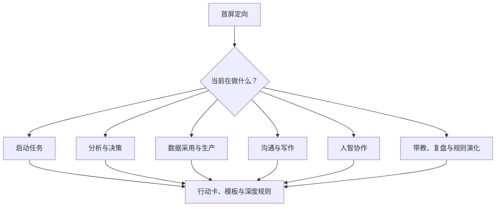
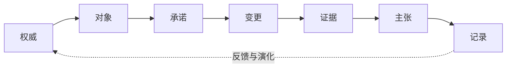
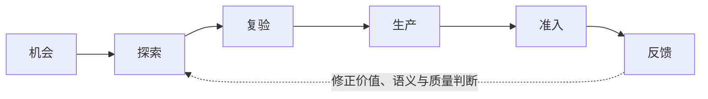
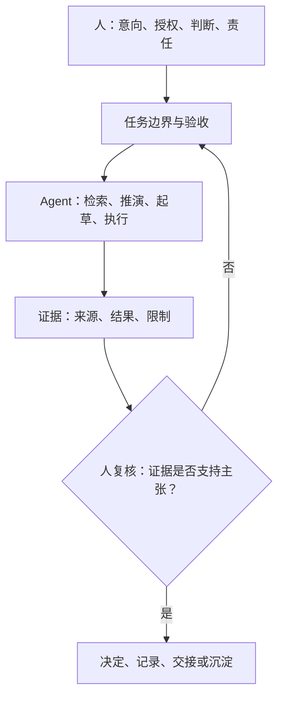
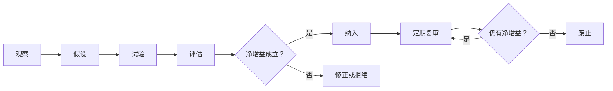

# Guidelines Reader Experience Overhaul Implementation Plan

> **For agentic workers:** REQUIRED SUB-SKILL: Use
> superpowers:executing-plans to implement this plan task-by-task. Steps use
> checkbox (`- [ ]`) syntax for tracking.

**Goal:** Rebuild the guidelines project into a visually rigorous, scene-routed
handbook that gives members and Agent the correct minimum reading path without
creating a second rule source.

**Architecture:** Keep `guidelines.md` as the sole normative source. Turn
`README.md` into a three-minute orientation page and `AGENTS.md` into a compact
Agent loading router. Add a host-local validation script that lints Markdown,
checks internal links and canonical contracts, and renders exactly five Mermaid
models into inspectable output.

**Tech Stack:** GitLab Markdown, Mermaid (`mmdc`), `markdownlint-cli2`, Bash,
Python 3, `glow`, and `pandoc`; no project runtime or build dependency is added.

## Global Constraints

- The normative rules remain only in `guidelines.md`.
- `README.md` and `AGENTS.md` route readers; they do not duplicate the rules.
- Preserve all existing substantive policy, data-quality, completion,
  responsibility, and evidence constraints.
- Use exactly five Mermaid diagrams in `guidelines.md`; each answers one action
  question and must be renderable by `mmdc`.
- Remove inline HTML and wrap prose so canonical Markdown passes
  `markdownlint-cli2 '**/*.md' '#.superpowers/**'` with zero errors.
- Use no decorative emoji, color-dependent meaning, proprietary renderer, or
  new project dependency.
- Human responsibility remains explicit: “人定其向，智扩其能；协作于事，归责于人。”
- The final implementation must be made in an isolated worktree, not on `main`.

---

## File Structure

| Path | Responsibility |
| --- | --- |
| `README.md` | Three-minute human orientation and scene routing |
| `guidelines.md` | Sole rules, visual models, scene cards, deep rules |
| `AGENTS.md` | Minimum-loading, task-to-anchor Agent router |
| `scripts/validate-docs.sh` | Lint, links, contracts, and Mermaid render QA |
| `CHANGELOG.md` | Reader-experience release record |
| `docs/decisions/` | Reason, scope, validation, and review record |
| `docs/superpowers/specs/...design.md` | Approved design; no normative rules |

## Task 1: Establish the document quality gate

**Files:**

- Create: `scripts/validate-docs.sh`
- Modify: `guidelines.md`
- Modify: `docs/decisions/2026-07-12-human-intelligence-collaboration.md`
- Modify: `docs/retrospectives/2026-07-12-baseline-establishment.md`

**Interfaces:**

- Consumes: repository root and optional `--render-dir <path>`.
- Produces: in its default final mode, exit code `0` only when Markdown lint,
  local links, canonical phrases, and five Mermaid SVG renders pass. The
  explicit pre-body mode accepts only zero Mermaid diagrams. Rendered artifacts
  are written to the supplied directory or a temporary directory.
- In default final mode, local fragments must resolve to a Markdown heading in
  the target file. The explicit pre-body mode checks local files but defers
  fragments owned by Task 3, so intermediate routes may be written first.

- [ ] **Step 1: Write the failing quality-gate invocation**

Run from the repository root:

```bash
./scripts/validate-docs.sh --allow-incomplete \
  --render-dir /tmp/data-guidelines-qa
```

Expected before implementation: shell failure because `scripts/validate-docs.sh`
does not exist.

- [ ] **Step 2: Normalize Markdown that currently violates lint**

Replace every metadata line using `<br>` with separate blockquote paragraphs.
Wrap prose in these existing files at 80 characters or fewer without changing
meaning:

```text
guidelines.md
docs/decisions/2026-07-12-human-intelligence-collaboration.md
docs/retrospectives/2026-07-12-baseline-establishment.md
```

Run:

```bash
markdownlint-cli2 '**/*.md' '#.superpowers/**'
```

Expected before the final wrapping pass: failures for `MD033/no-inline-html` and
`MD013/line-length`; expected after: `Summary: 0 error(s)`.

- [ ] **Step 3: Create the quality gate**

Create `scripts/validate-docs.sh` with this executable content:

```bash
#!/usr/bin/env bash
set -euo pipefail

ROOT="$(cd "$(dirname "${BASH_SOURCE[0]}")/.." && pwd)"
RENDER_DIR=""
EXPECTED_MERMAID=5

while [[ $# -gt 0 ]]; do
  case "$1" in
    --allow-incomplete)
      EXPECTED_MERMAID=0
      shift
      ;;
    --render-dir)
      RENDER_DIR="${2:?--render-dir requires a directory}"
      mkdir -p "$RENDER_DIR"
      shift 2
      ;;
    *)
      echo "unknown argument: $1" >&2
      exit 2
      ;;
  esac
done

if [[ -z "$RENDER_DIR" ]]; then
  RENDER_DIR="$(mktemp -d "${TMPDIR:-/tmp}/data-guidelines-qa.XXXXXX")"
  trap 'rm -rf "$RENDER_DIR"' EXIT
fi

for command in python3 markdownlint-cli2 mmdc; do
  command -v "$command" >/dev/null || {
    echo "missing required documentation QA command: $command" >&2
    exit 127
  }
done

cd "$ROOT"
markdownlint-cli2 '**/*.md' '#.superpowers/**'

python3 - "$ROOT" "$RENDER_DIR" "$EXPECTED_MERMAID" <<'PY'
from pathlib import Path
import re
import sys

root = Path(sys.argv[1])
render_dir = Path(sys.argv[2])
expected_mermaid = int(sys.argv[3])
markdown_files = sorted(root.rglob("*.md"))
local_link = re.compile(r"\[[^]]+\]\(([^)#]+)(?:#[^)]+)?\)")
mermaid_block = re.compile(r"```mermaid\n(.*?)\n```", re.S)

for path in markdown_files:
    text = path.read_text(encoding="utf-8")
    if text.count("```") % 2:
        raise SystemExit(f"unbalanced fenced block: {path.relative_to(root)}")
    for target in local_link.findall(text):
        if "://" in target or target.startswith("mailto:"):
            continue
        if not (path.parent / target).resolve().exists():
            raise SystemExit(
                f"broken local link: {path.relative_to(root)} -> {target}"
            )

main = root / "guidelines.md"
text = main.read_text(encoding="utf-8")
required = [
    "# 数据部门工作与人智协作准则",
    "人定其向，智扩其能；协作于事，归责于人。",
    "借智成事，依实定论，归责于人。",
    "## 8. 人智协作：边界、责任与验真",
]
for phrase in required:
    if phrase not in text:
        raise SystemExit(f"missing canonical contract: {phrase}")

blocks = mermaid_block.findall(text)
if len(blocks) != expected_mermaid:
    raise SystemExit(
        f"expected {expected_mermaid} Mermaid diagrams, found {len(blocks)}"
    )

for index, block in enumerate(blocks, start=1):
    (render_dir / f"guidelines-{index}.mmd").write_text(
        block + "\n", encoding="utf-8"
    )

print(
    f"validated {len(markdown_files)} Markdown files and extracted "
    f"{len(blocks)} diagrams"
)
PY

for source in "$RENDER_DIR"/*.mmd; do
  [[ -e "$source" ]] || continue
  target="${source%.mmd}.svg"
  mmdc -i "$source" -o "$target" -b white
  test -s "$target"
done

printf 'PASS documentation QA; rendered diagrams: %s\n' "$RENDER_DIR"
```

Then make it executable:

```bash
chmod +x scripts/validate-docs.sh
```

- [ ] **Step 4: Run the quality gate and inspect artifacts**

Run:

```bash
./scripts/validate-docs.sh --allow-incomplete \
  --render-dir /tmp/data-guidelines-qa
```

Expected: exit `0`, `validated ... Markdown files and extracted 0 diagrams`,
and no Mermaid rendering error. The default final mode requires five diagrams.

- [ ] **Step 5: Commit the gate**

```bash
git add scripts/validate-docs.sh guidelines.md \
  docs/decisions/2026-07-12-human-intelligence-collaboration.md \
  docs/retrospectives/2026-07-12-baseline-establishment.md
git commit -m "chore: add guidelines documentation quality gate"
```

## Task 2: Rebuild the human entry page and Agent router

**Files:**

- Modify: `README.md`
- Modify: `AGENTS.md`

**Interfaces:**

- Consumes: stable anchors in `guidelines.md`.
- Produces: a three-minute human route and a minimum-loading Agent route; neither
  file restates the complete policy.

- [ ] **Step 1: Replace README with the three-minute orientation structure**

Use this heading sequence and keep each section below 12 lines except the scene
navigation table:

```markdown
# 数据部门工作与人智协作准则

> 先求其真，使其可达；再令其有序，使其可行。

## 三分钟定向

| 先记住 | 含义 |
| --- | --- |
| 不欺真 | ... |
| 不越界 | ... |
| 不悬责 | ... |
| 不伪成 | ... |

## 我现在要做什么？

| 场景 | 进入正文 | 先取用 |
| --- | --- | --- |
| 启动复杂任务 | `guidelines.md#...` | 问题定义卡 |
| 分析、决策或诊断 | `guidelines.md#...` | 分析行动卡 |
| 数据采用或生产变更 | `guidelines.md#...` | 数据质量行动卡 |
| 汇报、会议或写作 | `guidelines.md#...` | 沟通与写作行动卡 |
| 调用、验收或交接 Agent | `guidelines.md#...` | 人智协作行动卡 |
| 带教、复盘或改规则 | `guidelines.md#...` | 演化行动卡 |

## 权威与演化

- `guidelines.md` 是唯一规则事实源。
- `AGENTS.md` 是 Agent 读取路由。
- `CHANGELOG.md` 记录生效变更。
- `docs/decisions/` 与 `docs/retrospectives/` 保存取舍和经验，不重写规则。
```

Use the actual final anchor links created in Task 3; run the quality gate to
prove every local link resolves.

- [ ] **Step 2: Replace AGENTS with the minimum-loading router**

Preserve the existing authority order and add this routing table:

```markdown
## 最小加载

1. 读取当前用户指令。
2. 读取 `guidelines.md` 的“任务内核卡”。
3. 按任务类别读取一个场景行动卡及其深度规则。
4. 修改前读取“人智协作：边界、责任与验真”与“规则生命周期”。

## 任务路由

| 任务 | 必读正文 | 必须确认 |
| --- | --- | --- |
| 分析/方案 | ... | 事实、假设、反例、行动 |
| 数据/生产 | ... | 时点、语义、质量、回滚 |
| 沟通/写作 | ... | 受众、结论、依据、请求 |
| 变更/自动化 | ... | 权限、并发、停止条件、验证 |
```

The table must link to final headings rather than repeat their detailed rules.

- [ ] **Step 3: Validate human and Agent entry routes**

Run:

```bash
./scripts/validate-docs.sh --allow-incomplete \
  --render-dir /tmp/data-guidelines-qa
rg -n '三分钟定向|我现在要做什么|最小加载|任务路由' README.md AGENTS.md
```

Expected: quality gate exit `0`; each of the four entry headings appears once.

- [ ] **Step 4: Commit entry routes**

```bash
git add README.md AGENTS.md
git commit -m "docs: add scene-based reader and agent routes"
```

## Task 3: Add the visual model and six scene action cards to the canonical body

**Files:**

- Modify: `guidelines.md`

**Interfaces:**

- Consumes: existing policy clauses and the scene routes from Task 2.
- Produces: five Mermaid diagrams, six action cards, and stable headings targeted
  by README and AGENTS.

- [ ] **Step 1: Add the opening visual route and task core**

Immediately after the current “如何使用本准则” section, add:



Precede it with “本图回答什么：我应从哪条路径进入。” Follow it with a
six-row scene navigation table that links to the six action cards below. Before
the diagram, add a `### 任务内核卡` heading: in no more than four short lines,
route readers to the task's authority, object and boundary, risk level,
acceptance claim, and the four bottom lines. It is a loading and routing card,
not a seventh scene action card or a duplicate rule source.

- [ ] **Step 2: Add six action cards without duplicating deep policy**

Create a new `## 场景行动卡` section before the first deep principle chapter.
Use these exact card headings and six fixed fields:

```text
### 启动任务卡
### 分析与决策卡
### 数据采用与生产卡
### 沟通与写作卡
### 人智协作卡
### 复盘与规则演化卡

何时使用：
先问什么：
最小输入：
必须产出：
停止/升级条件：
验真方式：
```

Fill each field with one concise, imperative sentence and end each card with
“深读：” plus links to the existing authoritative deep sections. Do not repeat
whole tables from those sections.

- [ ] **Step 3: Insert the credible-delivery Mermaid**

At `### 3.0 可信交付的最小内核`, add this diagram after the kernel chain:



Precede it with “本图回答什么：一次工作何以从授权走到可信结论。”

- [ ] **Step 4: Insert the data-adoption Mermaid**

At `## 5. 数据部门共同质量契约`, insert:



Precede it with “本图回答什么：数据为何要经历从线索到受控采用的连续判断。”

- [ ] **Step 5: Insert the human-intelligence Mermaid**

At `### 8.0 人智协作的含义`, insert:



Precede it with “本图回答什么：人、智能能力、事实与责任如何各得其位。”

- [ ] **Step 6: Insert the rule-lifecycle Mermaid**

At `### 11.6 规则与实践的生命周期`, insert:



Precede it with “本图回答什么：规则如何进入、被检验、被修正或退出。”

- [ ] **Step 7: Run canonical body validation**

Run:

```bash
./scripts/validate-docs.sh --render-dir /tmp/data-guidelines-qa
```

Expected: five Mermaid `.mmd` and five non-empty `.svg` files; no Markdown lint
or canonical-contract error.

- [ ] **Step 8: Commit canonical body**

```bash
git add guidelines.md
git commit -m "docs: add visual scene routes to guidelines"
```

## Task 4: Record the change and perform visual/multi-reader acceptance

**Files:**

- Modify: `CHANGELOG.md`
- Create: `docs/decisions/2026-07-12-reader-experience-overhaul.md`

**Interfaces:**

- Consumes: completed body, routes, validation script, and rendered artifacts.
- Produces: durable decision record plus fresh acceptance evidence.

- [ ] **Step 1: Add the change record**

Add a new top `## [2.1.0] — 2026-07-12` entry to `CHANGELOG.md` with these points:

```markdown
### 调整

- 重构阅读入口为“三分钟定向—场景路由—深度规则”。
- 在唯一规则正文中加入五张可渲染 Mermaid 与六张场景行动卡。
- 将 `README.md` 与 `AGENTS.md` 改为人类和 Agent 的定向入口，不复制规则。
- 新增可重复执行的文档质量门与视觉渲染检查。

### 未作的主张

- 本版本证明文档可读性与结构质量，不证明团队质量已经提高；
  仍需通过真实试点验证。
```

- [ ] **Step 2: Create the decision record**

Create `docs/decisions/2026-07-12-reader-experience-overhaul.md` with sections:

```markdown
# 决策：准则读者体验重构

> **状态**：已接受

## 问题
## 决定
## 增加、删除与净增益
## 验证证据
## 不作的主张
## 复审触发
```

State that the change preserves one rule source, uses five diagrams and six
action cards, and is accepted only after the Task 4 validation commands pass.

- [ ] **Step 3: Render and inspect all diagrams at two widths**

Run:

```bash
./scripts/validate-docs.sh --render-dir /tmp/data-guidelines-qa
for svg in /tmp/data-guidelines-qa/*.svg; do
  mmdc -i "${svg%.svg}.mmd" -o "${svg%.svg}-narrow.png" \
    -b white --width 768 --height 1100
done
```

Inspect every default SVG and narrow PNG. Reject and revise a diagram if any
label is clipped, any semantic edge crosses without need, the start state is
unclear, or the graph relies on color to convey state.

- [ ] **Step 4: Walk the four reading paths**

Record in the decision file that these paths each reach their next action:

```text
初读成员：README → 四条底线 → 场景导航 → 行动卡。
任务负责人：README → 启动/分析卡 → 深度规则 → 模板与验真。
Agent：AGENTS → 任务内核卡 → 场景规则 → 停止条件与验收。
维护者：README → CHANGELOG/决策 → 规则生命周期 → 复审入口。
```

- [ ] **Step 5: Run final verification**

Run:

```bash
./scripts/validate-docs.sh --render-dir /tmp/data-guidelines-qa
markdownlint-cli2 '**/*.md' '#.superpowers/**'
git diff --check HEAD
rg -n '```mermaid' guidelines.md | wc -l
```

Expected: all commands exit `0`; the final command reports `5`.

- [ ] **Step 6: Commit acceptance record**

```bash
git add CHANGELOG.md \
  docs/decisions/2026-07-12-reader-experience-overhaul.md
git commit -m "docs: record reader experience overhaul"
```

## Plan Self-Review

| Design requirement | Implemented by |
| --- | --- |
| One rule source | Tasks 2–3 retain policy only in `guidelines.md` |
| Human three-minute orientation | Task 2 README |
| Agent minimum path | Task 2 AGENTS and Task 3 action cards |
| Five Mermaid | Task 3 Steps 1 and 3–6; Task 4 renders all |
| Scene-specific usability | Task 3 Step 2 and Task 4 reading-path walk |
| Highest visual standards | Task 1 gate and Task 4 narrow/default inspection |
| No new dependency | Global constraints and Task 1 existing-command gate |
| Durable change record | Task 4 changelog and decision |

The plan contains no placeholder tasks. The main risk is prose drift during the
large `guidelines.md` edit; Task 1 establishes lint and canonical-contract
checks before that edit, and Task 4 requires rendered and reader-path evidence.
