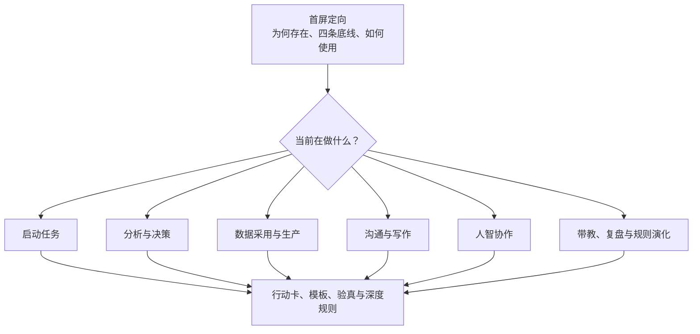
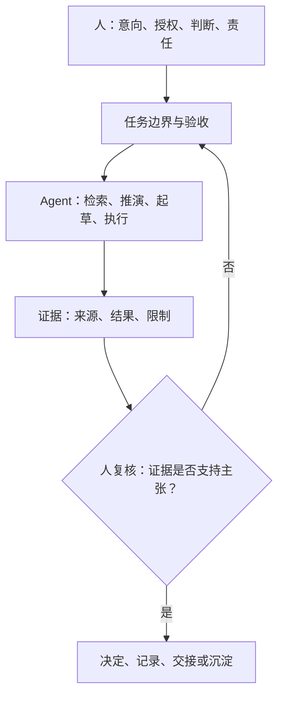

# 数据部门工作与人智协作准则：读者体验重构设计

> **日期**：2026-07-12
>
> **状态**：待用户审阅；本文件获确认前不得据此重构正文
>
> **权威正文**：[guidelines.md](../../../guidelines.md)
>
> **设计目标**：让成员与 Agent 在不同任务、不同深度下，以最短路径获得正确的规则、行动与验真要求。

## 1. 问题与目标

现行正文具备完整规则，但有 1,000 余行、多个深层章节和大量表格。它已经能回答“规则是什么”，却尚未充分回答：

- 初读者应先理解什么，才不会把准则读成又一份制度；
- 任务进行者如何从具体情境直接抵达行动、模板和验收；
- Agent 如何避免通读长文、同时又不遗漏权限、停止条件与证据要求；
- 管理者如何看见规则如何进入团队的反馈、培养与演化；
- 视觉元素如何压缩认知负担，而不制造装饰性复杂度。

本次重构只优化信息架构、导航、视觉模型、场景行动卡与协作路由；不弱化既有责任、证据、数据质量或人智协作约束。

### 成功标准

| 受众 | 最短成功路径 |
| --- | --- |
| 初读成员 | 三分钟内说清根本原则、四条底线、当前任务的进入路径与完成定义 |
| 任务负责人 | 两分钟内定位任务级别、问题定义卡、决策/风险模板和验收要求 |
| Agent | 先读取最小任务内核，再按任务路由加载事实源、权限、停止条件和验收锚点 |
| 管理者/维护者 | 看见质量信号、培养节奏、规则生命周期和复审入口 |

## 2. 设计原则

1. **正文唯一，入口可多**：`guidelines.md` 保持唯一规则事实源；`README.md` 和 `AGENTS.md` 只路由，不复制一套规则。
2. **先象后文**：先给读者全貌、路径与边界，再展开深度条款；图示解释关系，不替代证据与推理。
3. **按事取用，不按目录背诵**：以“我现在在做什么”而非组织结构作为主要入口。
4. **人智同源，读取分层**：成员和 Agent 使用同一原则、证据与责任链；Agent 只获得更短、更可执行的装载顺序。
5. **少而有力**：每张图、每张表、每个代码块都必须缩短决策或执行路径；不能产生净增益的视觉元素不加入。
6. **信、达、雅**：事实、判断、决定与行动仍分开；表达准确可用；版面克制、留白、层级清楚。
7. **视觉须经验证**：Mermaid 在源码中成立不等于读者看得懂；图表须通过语法渲染、视觉检查与读者路径检查。

## 3. 方案比较与选择

| 方案 | 做法 | 优点 | 风险 | 结论 |
| --- | --- | --- | --- | --- |
| A：视觉覆盖层 | 在现有正文中追加图、表和目录 | 改动小 | 长文主结构不变，入口仍然拥挤 | 不采用 |
| B：分层手册 | 分层正文，入口只路由 | 一处规则，服务所有受众 | 需维护锚点与链接 | **采用** |
| C：全面拆册 | 按分析、数据、沟通、Agent、管理拆分多份手册 | 单文档更短 | 规则漂移、引用链和维护成本上升 | 不采用 |

## 4. 目标信息架构



### 4.1 文件职责

| 文件 | 角色 | 允许承载 | 不承载 |
| --- | --- | --- | --- |
| `README.md` | 三分钟定向页 | 核心命题、四条底线、场景导航、规则入口 | 完整规则副本、项目局部事实 |
| `guidelines.md` | 唯一规则事实源 | 原则、模型、场景行动卡、深度规则、模板、演化 | 项目私有配置、一次性案例细节 |
| `AGENTS.md` | Agent 读取路由 | 最小加载顺序、任务类型到正文锚点的映射、修改约束 | 复制的规范正文、替代人工责任 |
| `CHANGELOG.md` | 已生效变更历史 | 版本、实质变化、边界 | 工作草稿或未验证效果 |
| `docs/decisions/` | 可追溯的关键取舍 | 问题、决定、净增益、验证与复审条件 | 新的规则事实源 |
| `docs/retrospectives/` | 经验与复盘 | 证据、教训、未完成事项 | 对正文的隐式修订 |

### 4.2 正文重组顺序

1. **开篇定向**：一句根本命题、四条底线、任务级别、场景入口；
2. **总览模型**：原则如何推导为可信交付、数据质量和人智协作；
3. **场景行动卡**：启动任务、分析决策、数据采用、沟通写作、人智协作、风险升级；
4. **深度规则**：保留现有原则、闭环、问题解决、数据质量、沟通、写作、完成、评审与运行机制；
5. **模板与演化**：可复制模板、质量信号、规则生命周期、复审入口。

## 5. 视觉与交互设计

### 5.1 Mermaid 图表

正文只保留五张高价值图：

| 图表 | 放置位置 | 回答的问题 |
| --- | --- | --- |
| 总览路由图 | 开篇 | 我现在从哪里进入？ |
| 可信交付闭环 | 可信交付模型前 | 一项工作怎样从授权走到可验证结论？ |
| 数据采用路径 | 数据质量章前 | 数据为何不能从线索直接变成可用资产？ |
| 人智协作责任链 | 人智协作章前 | 人、智能能力、事实与责任如何各得其位？ |
| 规则生命周期 | 运行与演化章前 | 新规则何时进入、修订或退出？ |

图内只放对象、关系、状态和判断节点；不堆砌段落，不用图代替正文。

### 5.2 视觉层级

- 首屏使用简短引言、四项底线卡和场景导航表，避免连续大段文字；
- 用 `---` 分隔大模块，使用二级标题承载任务域，三级标题承载具体动作；
- 用引用块突出“记住这一句”“不可突破的边界”“不作的主张”；
- 用短表呈现角色、选项、状态和检查项；每张表只回答一个问题；
- 用 `text` 代码块提供可复制的任务卡、升级卡、委托卡和交接卡；
- 不使用彩色表情、营销语、装饰性图标或不必要的 HTML 组件，确保 GitLab、终端和 Agent 均可稳定读取。

### 5.3 场景行动卡

每张行动卡固定为六格：

```text
何时使用：
先问什么：
最小输入：
必须产出：
停止/升级条件：
验真方式：
```

行动卡只摘录当前场景的最小动作；其规则依据通过正文锚点回链，不复制完整规范。

### 5.4 视觉构图标准

视觉不是装饰层，而是读者理解关系、顺序与边界的第二条路径。每个图表和页面必须同时满足：

| 维度 | 标准 | 拒绝信号 |
| --- | --- | --- |
| 语义 | 一张图只回答一个行动问题；节点是对象、状态、判断或动作 | 用同一张图同时讲原则、流程、角色和例外 |
| 构图 | 主路径顺着阅读方向展开；层级至多三层；尽量无交叉边 | 读者必须来回寻找起点，或靠颜色才能理解关系 |
| 密度 | 常规图控制在 5–9 个节点、1–2 个判断点；超过时拆图 | 节点内出现段落、注释或完整规则 |
| 文案 | 节点使用短名词或短动词；说明放在图外正文 | 图中堆满限定语，缩放后不可读 |
| 表格 | 只用于并列比较；常规控制在 3–5 列，每格只表达一件事 | 用表格模拟段落、流程或层级树 |
| 代码块 | 只放可复制的行动卡、命令或交接结构 | 用代码块承载解释性长文 |
| 克制 | 不依赖彩色表情、营销图标、渐变或专有 HTML | 视觉风格掩盖信息关系，或在终端失真 |

正文中的 Mermaid 采用统一语言：`flowchart TB` 用于由原则到行动的层级路径，`flowchart LR` 用于角色、证据与反馈关系；菱形仅表示真正的判断门。图示附近必须有一句“本图回答什么”，以及正文对图中不可见限制的补充。

### 5.5 视觉质量门槛与工具链

实现阶段使用现有工具，不向项目引入新的运行时或构建依赖：

| 检查层 | 工具/方法 | 通过条件 |
| --- | --- | --- |
| Markdown 结构 | `markdownlint-cli2` 与自定义链接/围栏检查 | 标题、表格、代码围栏、链接和术语无结构错误 |
| Mermaid 语法 | `mmdc` 渲染为 SVG | 每张图可稳定渲染，无语法或字体回退错误 |
| 视觉构图 | 将 SVG/PNG 在常见宽度下人工检查 | 无截断、重叠、不可读标签、无意义折线或失衡留白 |
| 终端可读性 | `glow` 或纯文本预览 | 无依赖图形样式才能成立的关键信息 |
| 多受众路径 | 人工按“成员/负责人/Agent/维护者”四种入口走读 | 每类受众均能在规定时间内找到下一动作 |

`mmdc`、`markdownlint-cli2`、`glow` 与 `pandoc` 已在本机可用；只有当现有工具无法验证某项明确质量门槛时，才评估安装补充工具，且不得把临时视觉工具引入项目运行依赖。

## 6. 人智协作的读者路径



- Agent 入口首先加载“任务内核卡”，随后按任务类别定位正文锚点；
- 人工入口首先看到场景导航与行动卡，随后进入深度规则；
- 二者最终都必须回到同一组事实、证据、责任和完成定义；
- 并行 Agent 只在任务可独立拆分时使用，并通过统一的证据汇合与人工整合收束。

## 7. 高级协作技巧的落地方式

| 技巧 | 文档落点 | 作用 |
| --- | --- | --- |
| 任务切片 | 人智协作行动卡 | 按对象、证据、方案或独立审查视角拆分，避免多人改同一事实源 |
| 独立复核 | 验真与评审卡 | 先独立写证据和判断，再比较分歧，防止声量替代事实 |
| 证据汇合 | 决策与交接卡 | 将来源、版本、范围、限制和验证结果汇入同一裁决面 |
| 反例优先 | 分析行动卡 | 主动寻找能推翻主要假设的最小观察或实验 |
| 分级授权 | 任务级别与 Agent 路由 | L0 快速推进，L1 留下可复查记录，L2 必须人工确认与独立复核 |
| 有界并行 | 并行 Agent 图与规则 | 每个子任务有输入、输出、停止条件和整合责任人 |
| 可恢复交接 | 交接卡 | 保留状态、证据、未完成项、恢复入口和禁止重复的无效尝试 |

## 8. 实施范围

### 要修改

- `README.md`：改为三分钟定向与场景导航；
- `guidelines.md`：在不降低规则覆盖的前提下重组正文、增加五张 Mermaid、增加场景行动卡和 Agent 路由锚点；
- `AGENTS.md`：由“阅读顺序”升级为“最小内核 + 任务路由 + 修改约束”；
- `CHANGELOG.md`、`docs/decisions/`：记录本次读者体验变更、净增益、验证和复审条件。

### 不修改

- 不新增独立规则事实源；
- 不把项目局部事实、权限或命令写入通用准则；
- 不把 Mermaid、模板或 Agent 快速入口当作完成证据；
- 不以文档美化替代真实试点、质量信号和团队校准；
- 不引入站点构建、前端依赖或需要专有渲染器的设计。

## 9. 验收与复审

### 文档验收

- 所有现有核心约束仍可定位，旧链接或入口不失效；
- 主文档含五张 Mermaid，且每张回答一个明确的行动问题；
- README 可在三分钟内完成定向，Agent 可在一次最小读取中获得任务路由；
- Markdown 结构、链接、代码块、Mermaid 围栏、术语与导航均可自动检查；
- 每张 Mermaid 均经 `mmdc` 渲染，并经 SVG/PNG 人工视觉检查；
- 首屏、场景导航、行动卡和深度规则在宽屏与窄屏阅读下层级稳定，不依赖颜色理解；
- 规则只存在于 `guidelines.md`，入口文件不复制正文。

### 运行验收

- 至少在分析、生产诊断和人智协作三类真实任务中试用；
- 观察成员是否能更快定位规则、形成更清楚的行动与验收；
- 观察 Agent 是否减少无关上下文加载、越界动作和无证据完成声明；
- 首轮试运行后，依据真实反馈删减、调整或补充，而非继续静态扩写。

### 复审触发

- 图表被读者跳过、误解或与正文漂移；
- 行动卡被机械填表而未改善判断；
- Agent 路由遗漏关键限制；
- 文档变长却未缩短读者完成任务的时间；
- 真实试点显示某一场景仍无法快速找到入口。
